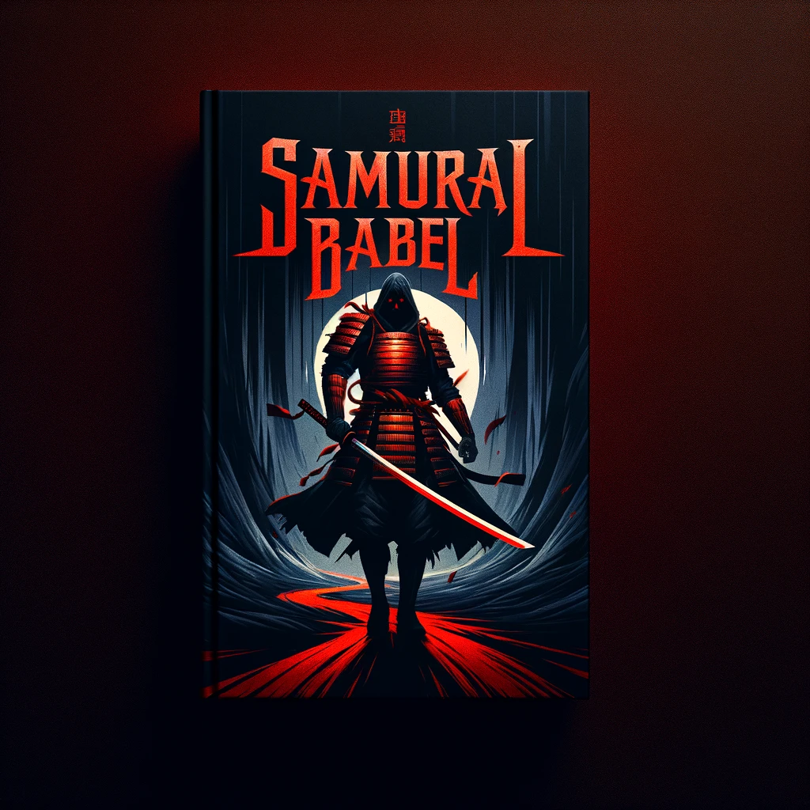

[](https://github.com/EthicalSource/contributor_covenant)



# Samurai Babel MMO - Open Source Game

Samurai Babel is an open-source project focused on creating a powerful and versatile game engine and editor designed specifically for Apple Silicon machines. We provide robust support for JSON, XML, and database operations, along with a comprehensive VM and interpreter for scripting and game logic. This project will utilize the **RingsCE** tool and engine, known for its flexibility and robustness.

## Goals
Our primary objective is to deliver an open-source game engine and editor that supports:
- JSON and XML parsing and manipulation
- Database operations
- Exclusive compatibility with Apple Silicon (macOS)
- A versatile VM and interpreter for custom scripting

## Database Goals
We aim to develop a library capable of handling JSON and XML data efficiently, providing seamless integration with the Samurai Babel engine.

## Version 1 (Updated)
- Compatible with Lazarus-IDE version 3
- Updated for macOS (Apple Silicon)
- Provides a robust foundation for future enhancements

## Parser and Reader
Our parser and reader components are designed to process data from the `ringsCE` data file folder, allowing for efficient manipulation of data stored in ZIP files. These components are located in the `data-dir` folder.

## Site
MMO Sign-up Website: [https://ringscejs.gleentech.com](https://ringscejs.gleentech.com)

## Documentation
To build this project, you need to install the following dependencies:
- Free Pascal
- GTK+3
- Qt Creator
- qt6
- qt5

Install GTK+3 using Homebrew:
```sh
brew install gtk+3 qt-creator qt qt@5
```

For more information on compiling and installing, visit the [documentation](https://ringscejs.gleentech.com/docs).

## Contributions
We welcome contributions from everyone. To contribute, please fork the repository and submit your pull requests.

## Contact Us
You can reach out to us through Discord: plvicente

## Roadmap

### 0.1 (Alpha)
- **Project Creation**
  - macOS (Apple Silicon) - DONE
- **CMake Boilerplate**
  - Conversion from Xcode Project - DONE
- **UDP Server**
  - Implementation - NOT YET IMPLEMENTED
- **Game Modes**
  - Switch between FPS and RPG - DONE
- **Launcher**
  - Qt6 Launcher for the Game - DONE but not yet fully implemented (see README inside the folder)

### 0.2 (Alpha)
- **Lua Scripting**
  - Implementation - NOT YET IMPLEMENTED
- **Metal Window**
  - Implementation - NOT YET IMPLEMENTED
- **UDP Server**
  - Completion - TO BE DONE

We are excited to embark on this journey with the community and look forward to your contributions and feedback. Together, we can create a powerful and flexible game engine for the next generation of games.

[](pdvicente@gleentech.com)
